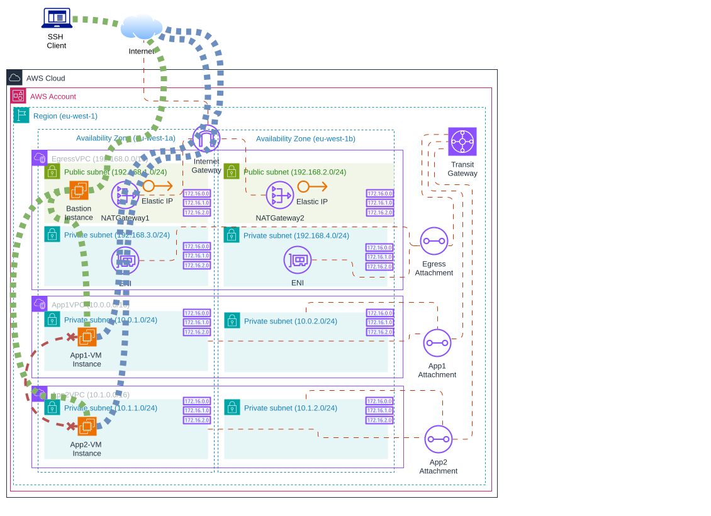

# Use Transit Gateway to create a single exit point to the internet from multiple VPCs

## Introduction

The cloudformation in this project are intended to be used in support of the AWS blog article here: [creating-a-single-internet-exit-point-from-multiple-vpcs-using-aws-transit-gateway](https://aws.amazon.com/blogs/networking-and-content-delivery/creating-a-single-internet-exit-point-from-multiple-vpcs-using-aws-transit-gateway)

The files contained here are as follows:

| File                                                                     | Description                                                                        |
|--------------------------------------------------------------------------|------------------------------------------------------------------------------------|
| [transitgateway-egress-solution.yml](transitgateway-egress-solution.yml) | Template to create the network infrastructure                                      |
| [transitgateway-test-ec2.yml](transitgateway-test-ec2.yml)               | Template to create the Bastion/Apps tests                                          |
| [init-aws-transit-gateway.sh](init-aws-transit-gateway.sh)               | Script to create AWS services using Cloudformation                                 |
| [connect-aws-transit-gateway.sh](connect-aws-transit-gateway.sh)         | Script to connect by Bastion instance to App instances a check internet connection |
| [delete-aws-transit-gateway.sh](delete-aws-transit-gateway.sh)           | Script to delete AWS services                                                      |

The cloudformation automatically creates the solution highlighted in the blog, and will populate the VPC route tables with the correct routes after creation of the transit gateway attachments. This function has recently been added to cloudformation.

The purpose of the cloudformation is to create this architecture ...

### Network


### Testing apps



## Create AWS services

Before, create a `key pair` with name [transit-gateway-key-pair](https://eu-west-1.console.aws.amazon.com/ec2/home?region=eu-west-1#CreateKeyPair) to link EC2 instances and copy into base project path

```bash
./init-aws-transit-gateway.sh
```


## Testing scripts

```bash
./connect-aws-transit-gateway.sh
```


## Delete AWS services

```bash
./delete-aws-transit-gateway.sh
```


## Costs

This architecture costs ...

* [AWS CloudFormation](https://eu-west-1.console.aws.amazon.com/cloudformation/home?region=eu-west-1#/stacks?filteringText=&filteringStatus=active&viewNested=true)
* [AWS VPC](https://eu-west-1.console.aws.amazon.com/vpcconsole/home?region=eu-west-1#vpcs)
* [Elastic IP](https://eu-west-1.console.aws.amazon.com/vpcconsole/home?region=eu-west-1#Addresses) 💰💰
* [AWS NAT Gateway](https://eu-west-1.console.aws.amazon.com/vpcconsole/home?region=eu-west-1#NatGateways) 💰💰💰
* [AWS Transit Gateway](https://eu-west-1.console.aws.amazon.com/vpcconsole/home?region=eu-west-1#TransitGateways) 💰💰💰
* [EC2 Instance](https://eu-west-1.console.aws.amazon.com/ec2/home?region=eu-west-1#Instances) 💰

## License

> This library is licensed under the MIT-0 License. See the LICENSE file.
